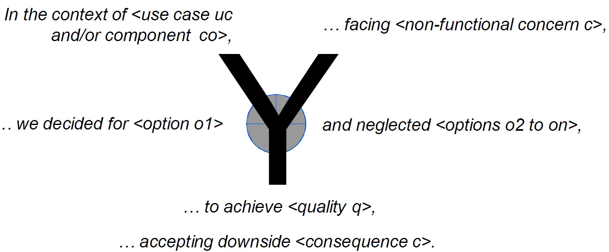

# What is ADR?

ADR or Architecture Decision Records in software development, it is the best practice for documenting architectural decisions in a structured and defined way.

The Value of ADRs in Modern Software Development

**Traceability**: Offers a clear lineage of decisions, aiding in project transitions.

**Communication**: Facilitates effective dialogue among stakeholders, ensuring alignment on architectural choices.

**Control and Reflection**: Enables teams to revisit decisions, assessing their impact and making necessary adjustments.

**Educational Tool**: A valuable resource for learning from past projects, enhancing decision-making in architecture.

**Compliance**: Essential for documenting adherence to regulatory and industry standards.

**Development Efficiency**: Streamlines the development process by reducing time spent on architectural discussions.

 
## Template 1

#### Title
Give a meaningful name that quickly lets the reader understand what this ADR is all about.

#### Status
Note the status of this ADR. This depends on the individual process of your team or company. Usually, this section only holds a single word defining the status.

Examples are: proposed, accepted, rejected, deprecated, superseded

#### Issue / Context
This section explains the context, problem, or issue that causes the need for this decision. Some also call this section "motivation".

Be precise and focus on facts.

#### Decision
Describe the proposed change. Stick to the facts and don’t try to sell the decision. Also, describe how and why you came to this decision. Point out **alternatives** that were looked at during the decision-finding process.

#### Consequences
Describes the effects of the change. What becomes easier? What will be more difficult?
- Explains the results of the decision over the long term.
- Did it work, not work, was changed, upgraded, etc.

#### Examples:
- [Choosing a CSS framework](https://github.com/joelparkerhenderson/architecture-decision-record/tree/main/locales/en/examples/css-framework)

## Template 2 - Y-Statements
*Based on this article: [Y-Statements - A light template for architectural decision capturing](https://medium.com/olzzio/y-statements-10eb07b5a177)*

1. context: functional requirement (story, use case) or arch. component,
2. facing: non-functional requirement, for instance a desired quality,
3. we decided: decision outcome (arguably the most important part),
4. and neglected alternatives not chosen (not to be forgotten!),
5. to achieve: benefits, the full or partial satisfaction of requirement(s),
6. accepting that: drawbacks and other consequences, for instance impact on other properties/context and effort/cost (both short term and long term).

## Other templates
- [ADR template for Alexandrian pattern](https://github.com/joelparkerhenderson/architecture-decision-record/tree/main/locales/en/templates/decision-record-template-for-alexandrian-pattern) (simple with context specifics)
- [ADR template of the Markdown Any Decision Records (MADR) project](https://github.com/joelparkerhenderson/architecture-decision-record/tree/main/locales/en/templates/decision-record-template-of-the-madr-project) (both simple and elaborate version; the latter emphasizes options and their pros and cons)

---
### Links & Sources

- https://adr.github.io/
- https://medium.com/olzzio/y-statements-10eb07b5a177
- https://github.com/joelparkerhenderson/architecture-decision-record
- https://habr.com/ru/articles/781624/
